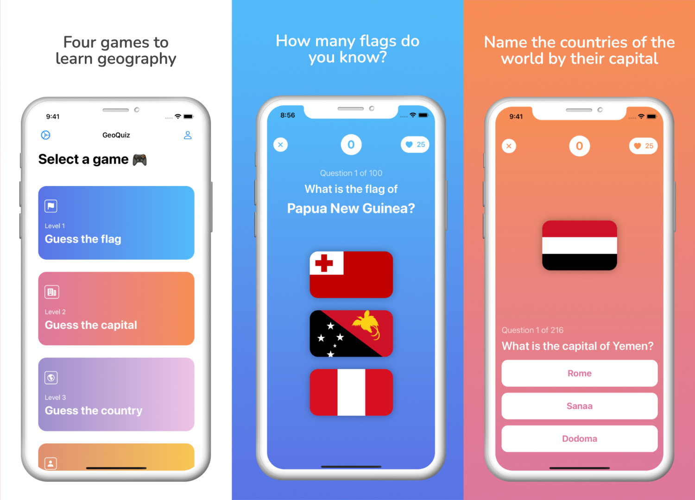
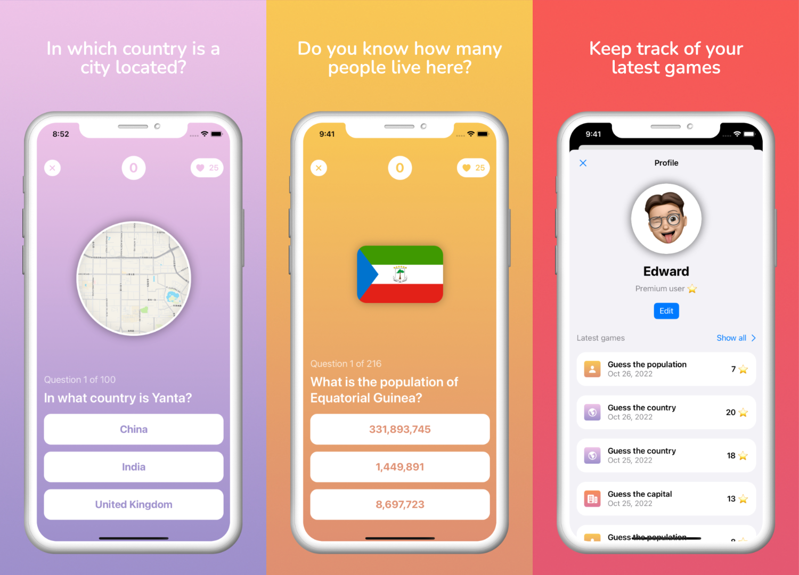
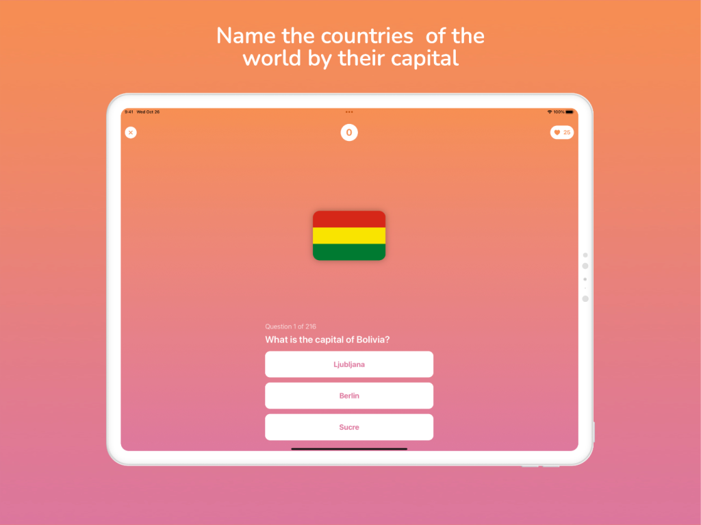

# geoquiz

Geoquiz is a geography game for iOS written in Swift and SwiftUI. I also implemented In-App purchases with the help of [RevenueCat](https://revenuecat.com/).

Right now it has 70 monthly downloads on average and I’m able to earn some pocket money from it.

